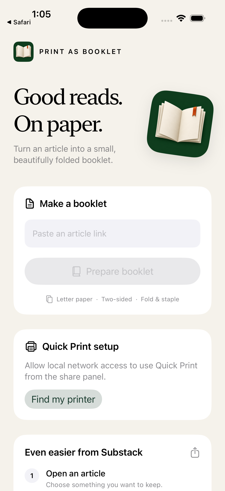
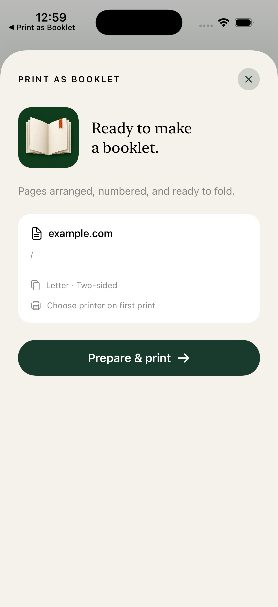

# iPhone app

Share a Substack article, prepare the booklet, and print it.

  
  

## Install

Requires Xcode and iOS 17+.

1. Open `PrintAsBooklet.xcodeproj`.
2. Select your Personal Team under **Signing & Capabilities** for both
   **PrintAsBooklet** and **PrintAsBookletShare**.
3. Select your iPhone and run the app.

If the bundle IDs are unavailable, change both. The extension's ID must start
with the app's ID. A free Personal Team works; no App Groups are required.

## Print

1. Tap **Find my printer** in the app and allow Local Network access.
2. In Substack, share an article → **Print as Booklet** → **Prepare & print**.
3. Select a printer and print once. Later jobs use the saved printer.

Or paste an article link on the home screen and print through AirPrint.
Keep the phone and printer on the same Wi-Fi network.

Paid articles may need sign-in. The app and share panel have separate Substack
sessions, so each may ask you to sign in once.

## If printing fails

The prepared booklet stays available. Tap **Standard Print / Change Printer**
to use AirPrint without downloading it again. If the connection drops during
submission, check the printer before retrying to avoid a duplicate.

“Sent to printer” means the job was accepted. Physical duplex output from the
updated Quick Print path still needs verification.

[Tests and implementation notes](../docs/printing.md)
